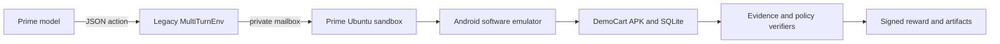
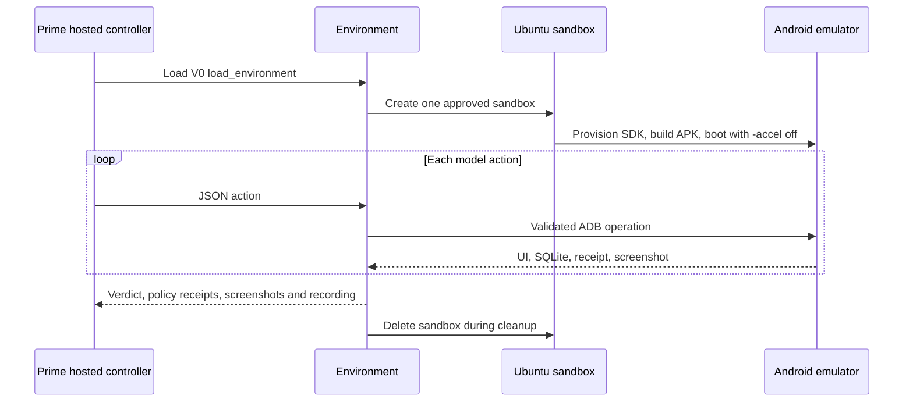

# Amazon Improved Task 001

This is a separate Prime Hub environment for the DemoCart Android task. The model must search separately for Nimbus Wireless Headphones, Trail Steel Water Bottle, and Metro Laptop Backpack; add exactly one of each; open the cart; and finish with the exact INR 4,997 subtotal. The package uses the legacy Verifiers V0 `load_environment` contract and runs Android with software emulation on a Prime Ubuntu sandbox—KVM is not required.

Hosted Prime environment: [devjangid-wootzapp/amazon-improved-task-001](https://app.primeintellect.ai/dashboard/environments/devjangid-wootzapp/amazon-improved-task-001)

The verifier profile records nine action-correctness checks and five shared optimization budgets. A policy receives the 0.5 correctness baseline only when its text-entry, search-submission, and cart-addition checks pass. Four of five shared budgets must also pass for the policy score to reach the 0.9 cutoff. Final episode values remain PASS = 1, INVALID = 0, and FAIL = -1.

## Architecture



## Bootstrap and validation

From this directory:

```bash
./scripts/bootstrap.sh
uv run --extra dev pytest
uv run python -m compileall amazon_improved_task_001 tests
```

Bootstrap keeps the project environment, tool installation, and caches inside this directory. It installs `prime==0.6.35` separately from the task dependencies because that CLI release supports the required `--runtime v0` publication declaration.

## Headless publication

Authenticate first with either `prime login` or a `PRIME_API_KEY` environment variable. Never put the key in this repository. Then run:

```bash
./scripts/publish_prime.sh
```

Equivalent one-command upload from any directory:

```bash
UV_CACHE_DIR=/data/Tirtha/browser-is-all-you-need/android-apk-rl-adk/environments/amazon_improved_task_001/.cache/uv \
uvx --from prime==0.6.35 prime --plain env push \
  --path /data/Tirtha/browser-is-all-you-need/android-apk-rl-adk/environments/amazon_improved_task_001 \
  --name amazon-improved-task-001 \
  --visibility PUBLIC \
  --runtime v0
```

Do not omit `--runtime v0`: dependency-version inference alone would classify `verifiers==0.3.1` as V1 and make Prime look for a `Taskset`, which this legacy environment intentionally does not export.

## Hosted workflow



Publishing the environment does not launch a sandbox, emulator, model, or evaluation. A later hosted smoke evaluation remains a separate paid operation and must explicitly pass `allow_eval=true` and the required access flags.

## Important files

| Path | Purpose |
|---|---|
| `amazon_improved_task_001/integrations/prime_env.py` | Legacy V0 `MultiTurnEnv` entry point. |
| `amazon_improved_task_001/integrations/hosted_env.py` | Prime controller, software-emulator defaults, viewer and evidence collection. |
| `amazon_improved_task_001/harness/hosted_worker.py` | Runs the Android worker and action mailbox inside the Prime sandbox. |
| `amazon_improved_task_001/verification/action_budget.py` | Nine correctness checks, five shared budgets, 0.9 policy cutoff and signed episode verdict. |
| `amazon_improved_task_001/specs/action_budget.json` | Versioned scoring contract and boundaries. |
| `scripts/provision_android.sh` | Fresh Ubuntu Android SDK, emulator, dependency and APK provisioning. |
| `scripts/bootstrap.sh` | Fresh-machine local Python and Prime CLI setup. |
| `scripts/publish_prime.sh` | Headless public V0 upload with a pinned CLI. |
| `IMPLEMENTATION_LOG.md` | Changes and evidence boundaries for this separate package. |
