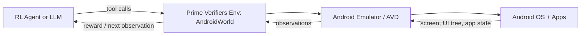
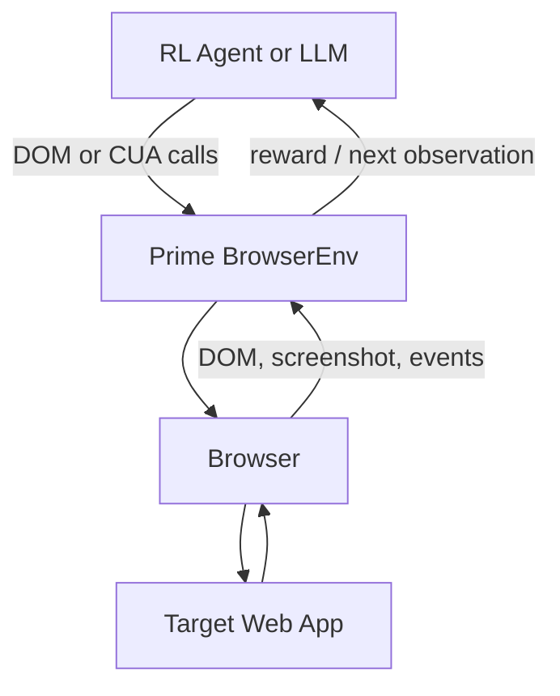

# Prime Intellect Android ADK RL Environments

Last updated: 2026-06-03

## Executive Summary

The strongest Prime Intellect candidate for Android ADK-style RL work is `primeintellect/androidworld`, based on Google Research AndroidWorld.

AndroidWorld runs agents against a live Android emulator and provides a benchmark of Android app tasks with durable reward checks. It is the only option identified here that explicitly supports native Android app/device interaction through an emulator.

AndroidWorld is not, by itself, a ready-made benchmark for commercial apps such as Amazon, DoorDash, or Uber. Those workflows require either:

- adding APKs and custom AndroidWorld tasks,
- using web versions through BrowserEnv,
- adapting an external Android benchmark such as AndroidLab,
- or building a custom ADB/UIAutomator/Appium wrapper.

Recommended path:

1. Use AndroidWorld first for native Android RL/evaluation.
2. Use BrowserEnv for shopping, delivery, or ride-hailing workflows only when web UX is acceptable.
3. Prototype custom APK-backed AndroidWorld tasks when native app fidelity is required.
4. Use AndroidLab as an external reference, not as a Prime-native environment.

This repository now also includes a runnable local scaffold with one task, `CreateNoteTask`. It uses a deterministic mock Android notes app so the environment loop can run without Android SDK, an emulator, or Prime credentials.

Run it with:

```bash
python3 -m android_adk_rl_env.runner --task create_note --policy scripted
```

Test it with:

```bash
python3 -m unittest discover -s tests
```

## Runnable Project

The local project demonstrates the same task lifecycle that should later be connected to AndroidWorld or ADB:

```text
Task goal
  -> initialize mock Android state
  -> agent emits Android-style actions
  -> environment updates app/device state
  -> validator checks durable note state
  -> reward is returned
```

Current task:

| Task | Goal | Validator | Reward |
|---|---|---|---:|
| `CreateNoteTask` | Create a note titled `AndroidWorld Pilot` with body `Validate one runnable task.` | Exact note exists in durable mock app state | `1.0` on success, `0.0` otherwise |

Current action space:

| Action | Purpose |
|---|---|
| `open_app` | Launch the mock Notes app |
| `tap` | Tap UI targets such as `new_note`, `title`, or `body` |
| `input_text` | Fill the focused field |
| `submit` | Save the note |
| `navigate_back` | Simulate Android back navigation |

Project layout:

```text
android_adk_rl_env/
  actions.py
  env.py
  runner.py
  tasks/
    base.py
    create_note.py
configs/eval/smoke.toml
tests/test_create_note.py
```

The real Android integration point is `MockAndroidDevice`. Replace that class with an ADB/UIAutomator/Appium/AndroidWorld controller while preserving the task API and reward contract.

## Environment Comparison

| Environment | Android support | Best use | RL integration path | Limitations |
|---|---:|---|---|---|
| AndroidWorld / `primeintellect/androidworld` | Yes | Native Android emulator tasks | Prime eval plus AndroidWorld task validators | Heavy emulator setup; no built-in Amazon/DoorDash/Uber tasks in provided sources |
| BrowserEnv | No native Android; web only | Web versions of target workflows | Prime Verifiers browser harness | Does not exercise Android app screens or Android OS state |
| AndroidLab | Yes, external | Research reference for Android-agent tasks | Manual integration or custom Prime wrapper | Not a Prime Intellect environment by default |
| Custom ADB/Appium wrapper | Yes | Arbitrary APKs and bespoke workflows | Build a Gym/Verifiers environment with custom reward logic | Highest effort; reward/state extraction must be engineered |

## What AndroidWorld Is

AndroidWorld is a benchmark/runtime for autonomous agents controlling a live Android emulator.

The task pattern is:

```text
TaskEval class
  -> generates a natural-language goal
  -> prepares app/device state
  -> agent interacts with Android
  -> validator checks device/app state
  -> task returns success/failure reward
```

Important upstream properties:

- 116 hand-crafted tasks across 20 apps.
- Randomized task parameters for many task variations.
- Durable reward signals rather than pure screenshot matching.
- Extensible task structure for adding apps and task validators.
- Local Android SDK/AVD setup required for upstream development.

Primary source: https://github.com/google-research/android_world

## Prime Evaluation Flow

The Prime environment slug is:

```text
primeintellect/androidworld
```

Start by checking the currently published package metadata and CLI options:

```bash
prime login
prime env info primeintellect/androidworld
prime eval run primeintellect/androidworld --help
```

Typical local evaluation shape:

```bash
prime env install primeintellect/androidworld@latest
prime eval run primeintellect/androidworld \
  -m openai/gpt-4.1-mini \
  -p openai \
  -k OPENAI_API_KEY \
  -n 1 \
  -r 1
```

If hosted execution is supported by the published package:

```bash
prime eval run primeintellect/androidworld --hosted --follow
```

Prime CLI flags and environment-specific arguments can change with the package version, so use `prime env info` and `--help` before scripting large runs.

Prime evaluation docs: https://docs.primeintellect.ai/tutorials-environments/evaluating

## Local AndroidWorld Development Flow

Use this path when developing or debugging AndroidWorld tasks directly.

```bash
git clone https://github.com/google-research/android_world.git
cd android_world
python3 -m venv .venv
source .venv/bin/activate
pip install -r requirements.txt
python setup.py install
```

AndroidWorld expects Python 3.11 or newer for the direct local flow.

Create and launch an Android Virtual Device. Upstream recommends a Pixel 6 style AVD using Android API 33, launched from the command line with gRPC enabled:

```bash
EMULATOR_NAME=AndroidWorldAvd
~/Android/Sdk/emulator/emulator -avd "$EMULATOR_NAME" -no-snapshot -grpc 8554
```

Check ADB:

```bash
adb devices
```

Run one task:

```bash
python minimal_task_runner.py --task=ContactsAddContact --perform_emulator_setup
```

After first setup:

```bash
python minimal_task_runner.py --task=ContactsAddContact
```

Run a subset through the full runner:

```bash
python run.py \
  --suite_family=android_world \
  --agent_name=t3a_gpt4 \
  --tasks=ContactsAddContact,ClockStopWatchRunning \
  --n_task_combinations=1 \
  --output_path=./runs
```

Resume from a checkpoint:

```bash
python run.py \
  --suite_family=android_world \
  --agent_name=t3a_gpt4 \
  --checkpoint_dir=./runs/<previous_run_dir>
```

## Dockerized Android Runtime

Upstream AndroidWorld has experimental Docker support:

```bash
cd android_world
docker build -t android_world:latest .
docker run --privileged -p 5000:5000 -it android_world:latest
```

For packages that provide browser/runtime helper scripts, the equivalent shape is:

```bash
./scripts/build_browser.sh
./scripts/start_browser.sh
```

Useful runtime endpoints may include:

```text
Android World API: http://localhost:45000/health
CDP:               ws://localhost:39224
noVNC:             http://localhost:6080
ADB:               localhost:5555
```

Use noVNC to inspect the emulator visually:

```text
http://localhost:6080
```

## AndroidWorld Task Structure

Important files in upstream AndroidWorld:

```text
android_world/android_world/task_evals/task_eval.py
android_world/android_world/task_evals/single/*.py
android_world/android_world/task_evals/composite/*.py
android_world/android_world/task_evals/common_validators/
android_world/android_world/registry.py
```

A task normally defines:

| Field or method | Purpose |
|---|---|
| `app_names` | App names used by the task |
| `complexity` | Approximate step budget multiplier |
| `template` or `goal` | Natural-language instruction |
| `generate_random_params()` | Creates randomized task parameters |
| `initialize_task(env)` | Sets up initial app/device state |
| `is_successful(env)` | Checks final state and returns reward |
| `tear_down(env)` | Cleans up task-created state |

Prefer durable validators:

| Validator style | Use when state lives in |
|---|---|
| SQLite validator | App database under `data/data/<package>/databases/` |
| File validator | App files or app-specific storage |
| Custom `TaskEval` | UI-only, network, system setting, or app-specific behavior |

## Adding A New APK-Backed Task

### 1. Inspect The App

Find the package:

```bash
adb shell pm list packages | grep -i myapp
```

Inspect storage:

```bash
adb shell ls data/data/<package_name>/
adb shell ls data/data/<package_name>/databases/
adb shell ls data/data/<package_name>/files/
```

For SQLite:

```bash
adb shell "sqlite3 data/data/<package_name>/databases/<db_name>.db '.tables'"
adb shell "sqlite3 data/data/<package_name>/databases/<db_name>.db '.schema <table_name>'"
adb shell "sqlite3 data/data/<package_name>/databases/<db_name>.db 'SELECT * FROM <table_name> LIMIT 5;'"
```

For file state:

```bash
adb shell find data/data/<package_name>/files -maxdepth 3 -type f
adb shell cat data/data/<package_name>/files/<file_name>
adb pull data/data/<package_name>/files/<file_name> ./debug_files/
```

### 2. Create The Task Class

Create a file such as:

```text
android_world/android_world/task_evals/single/my_app.py
```

Minimal skeleton:

```python
from android_world.env import adb_utils
from android_world.env import interface
from android_world.task_evals import task_eval


class MyAppCreateItem(task_eval.TaskEval):
  app_names = ("my app",)
  complexity = 2
  template = "In My App, create an item named {item_name}."

  def __init__(self, params):
    super().__init__(params)

  @classmethod
  def generate_random_params(cls):
    return {"item_name": "Sample Item"}

  @property
  def goal(self):
    return self.template.format(**self.params)

  def initialize_task(self, env: interface.AsyncEnv) -> None:
    super().initialize_task(env)
    adb_utils.launch_app("my app", env.controller)

  def is_successful(self, env: interface.AsyncEnv) -> float:
    return 1.0 if self._target_state_exists(env) else 0.0

  def tear_down(self, env: interface.AsyncEnv) -> None:
    super().tear_down(env)
```

Replace `_target_state_exists` with a real database, file, setting, or app-state check.

### 3. Register The Task

Edit:

```text
android_world/android_world/registry.py
```

Add the import:

```python
from android_world.task_evals.single import my_app
```

Add the class to `TaskRegistry._TASKS`:

```python
my_app.MyAppCreateItem,
```

The task name becomes:

```text
MyAppCreateItem
```

### 4. Add The APK

For a Dockerized package:

```bash
cp /path/to/MyApp.apk android_world/docker_setup/apks/MyApp.apk
```

Rebuild and restart:

```bash
./scripts/build_browser.sh
./scripts/stop_browser.sh
./scripts/start_browser.sh
```

Confirm install:

```bash
docker exec slack-offline-env-browser sh -lc "adb wait-for-device && adb shell pm list packages | grep -i myapp"
```

Find launchable activity:

```bash
docker exec slack-offline-env-browser sh -lc "adb shell cmd package resolve-activity --brief <package_name>"
```

### 5. Add Launch Mapping

Edit:

```text
android_world/android_world/env/adb_utils.py
```

Add an activity mapping:

```python
"my app|myapp": "com.example.myapp/.MainActivity",
```

Then tasks can launch by friendly name:

```python
adb_utils.launch_app("my app", env.controller)
```

### 6. Add Optional Setup

If the app needs permissions, onboarding, seed data, or app-data resets, add an app setup class:

```text
android_world/android_world/env/setup_device/apps.py
```

Example:

```python
class MyApp(AppSetup):
  app_name = "my app"
  apk_names = ("MyApp.apk",)

  @classmethod
  def setup(cls, env):
    super().setup(env)
    adb_utils.grant_permissions(
        cls.package_name(),
        "android.permission.POST_NOTIFICATIONS",
        env.controller,
    )
```

Only setup what is required for reproducible task execution.

### 7. Test

Smoke test:

```bash
python minimal_task_runner.py --task=MyAppCreateItem --perform_emulator_setup
python minimal_task_runner.py --task=MyAppCreateItem
```

Suite test:

```bash
python run.py \
  --suite_family=android_world \
  --agent_name=t3a_gpt4 \
  --tasks=MyAppCreateItem \
  --n_task_combinations=3 \
  --output_path=./runs
```

## Alternatives

### BrowserEnv

Use BrowserEnv when the target task can run through a website instead of a native Android app. This is suitable for some shopping or delivery workflows if the website exposes the needed flow.

Advantages:

- Easier than native Android setup.
- Works with DOM or computer-use style browser agents.
- Fits Prime Verifiers browser examples and standard `prime eval run` workflows.

Limitations:

- Does not validate native Android UI behavior.
- Does not test Android permissions, intents, app storage, notifications, or native app flows.
- Some commercial services block automation or require real accounts/payment flows.

### AndroidLab

AndroidLab is an external Android-agent benchmark with Android emulator support and a benchmark suite. It is useful as a reference for task design and evaluation patterns, but it is not a Prime Intellect environment by default.

Source: https://github.com/THUDM/Android-Lab

### Custom ADB/Appium/Gym Wrapper

Use this path when the target must be a native app and AndroidWorld does not fit.

Architecture:

```text
RL Agent / LLM
  -> tool calls
  -> custom Verifiers or Gym environment
  -> ADB/UIAutomator/Appium
  -> Android emulator + APK
  -> screenshot/UI tree/app state
  -> reward function
  -> rollout result
```

This enables arbitrary APKs but requires custom engineering for:

- action space,
- observation format,
- reset/setup,
- account management,
- durable reward extraction,
- emulator lifecycle,
- flaky UI handling,
- and safety boundaries for real-world services.

## Architecture

AndroidWorld flow:



Browser fallback flow:



## Good Task Design Checklist

- Goal is clear and natural-language.
- Target app/package is installed and launchable.
- Initial state is deterministic.
- Random parameters are varied but valid.
- Success check uses durable state where possible.
- UI-only checks are used only when no durable state exists.
- Task cleans up state or resets app data.
- Task is registered in `registry.py`.
- Task runs with `minimal_task_runner.py --task=<TaskName>`.
- Suite test runs multiple parameter combinations.
- APKs are included in the runtime image or install path.
- Permissions and onboarding are handled before evaluation starts.
- Repeated runs do not leak state across samples.

## Common Failure Points

| Problem | Fix |
|---|---|
| APK not installed | Rebuild image, restart container, check APK install logs |
| App opens to onboarding | Add setup clicks, permissions, or seeded state |
| Task not found | Import task module and register the class |
| App cannot launch by name | Add an activity mapping in `adb_utils.py` |
| Score is flaky | Use SQLite/file/device-state validators instead of screenshots |
| Emulator is slow | Use Linux with `/dev/kvm`; avoid nested Mac/Windows emulation |
| Runs contaminate each other | Reset app data and seed only required records |

## Final Recommendation

For Prime Intellect Android ADK RL work:

1. Start with `primeintellect/androidworld`.
2. Run a small baseline evaluation through Prime CLI.
3. If native custom apps are needed, add APK-backed AndroidWorld tasks.
4. If the target workflow is web-friendly, use BrowserEnv as the lower-effort fallback.
5. If AndroidWorld does not provide enough control, build a custom ADB/Appium environment using Verifiers or a Gym-style wrapper.

The highest-confidence implementation for a new native Android benchmark task is:

```text
APK installed in runtime
+ launch mapping
+ optional setup class for permissions/onboarding
+ deterministic TaskEval initialization
+ durable validator
+ registry entry
+ minimal task smoke test
+ multi-parameter suite run
+ Prime eval packaging if needed
```


## APK-Backed Dummy App Status

Implemented on 2026-06-03:

- Added a minimal Java Android app at `dummy_android_app/` with package `com.primeintellect.dummyrl`.
- Added direct APK build/install scripts under `scripts/`.
- Added `AdbDevice`, an ADB/UIAutomator action layer that finds controls by resource ID, taps bounds, verifies focus, and types text.
- Added `DummyApkFormSearchTask`, which searches, fills name/email fields, submits the form, and validates durable SharedPreferences state.
- Added documentation at `docs/dummy_apk_rl_env.md`.

Verified on connected Android device `localhost:5555`:

```bash
./scripts/build_dummy_apk.sh
./scripts/install_dummy_apk.sh
python3 -B -m android_adk_rl_env.runner --task dummy_apk --policy adb-scripted --compact
```

Result: `success=true`, `reward=1.0`, status text `Submitted: Ada Lovelace <ada@example.com>`.
